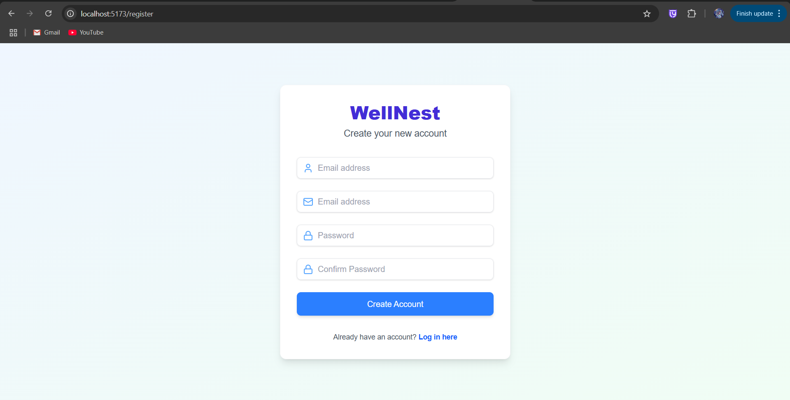
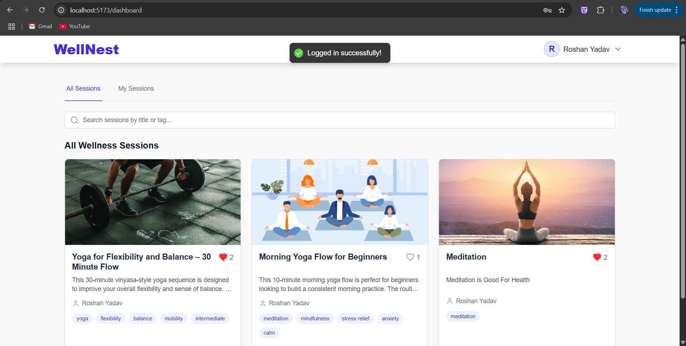
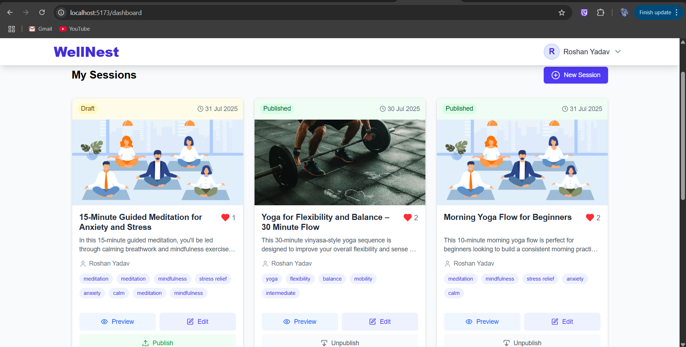
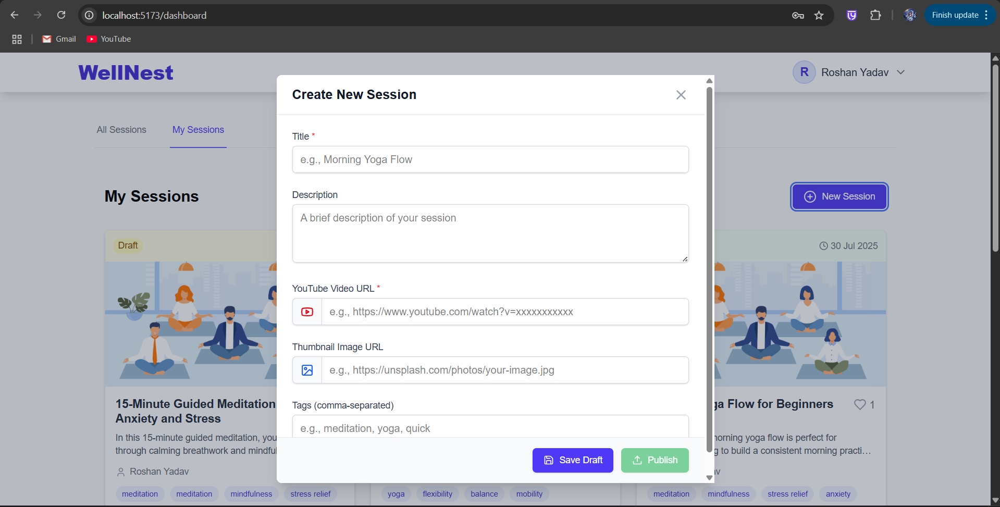
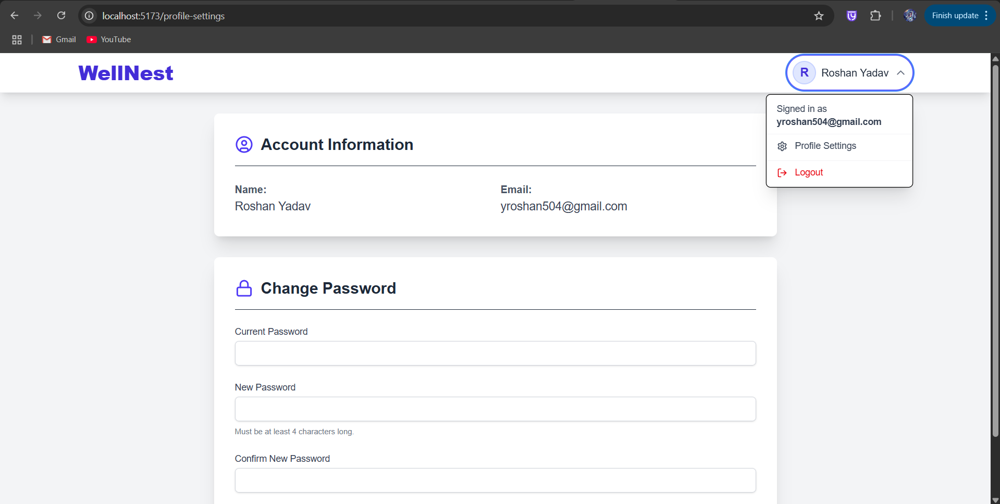

# WellNest: Secure Wellness Session Platform

[](https://nodejs.org/)
[](https://expressjs.com/)
[](https://react.dev/)
[](https://tailwindcss.com/)
[](https://www.mongodb.com/)
[](https://jwt.io/)

## 1\. Objective

WellNest is a full-stack application designed to be a secure platform for wellness sessions. Users can register, log in, view public wellness sessions, and manage their own sessions (drafting, publishing, editing, and deleting). The platform emphasizes secure authentication, efficient session management, and an intuitive user interface.

-----

## 2\. Features

### Core Features

  * **Secure Authentication:**
      * User registration (`/register`) with hashed passwords.
      * User login (`/login`) returning a JSON Web Token (JWT).
      * JWT storage in the frontend (localStorage).
      * Protected routes using JWT middleware on the backend.
  * **Session Management API:**
      * Retrieve all **publicly published** wellness sessions.
      * Retrieve a logged-in user's **own sessions** (including drafts).
      * View details of a single session by ID.
      * Create and update session drafts.
      * Publish a drafted session.
      * Like/Unlike sessions.
      * Delete user's own sessions.
  * **Frontend Pages:**
      * **Login / Register:** Forms for user authentication and JWT handling.
      * **Dashboard:** Displays all publicly published wellness sessions.
      * **My Sessions:** Allows users to view, edit, and manage their own drafted and published sessions.
      * **Session Editor:** Form for creating new sessions and editing existing ones, including:
          * Title
          * Tags (comma-separated input)
          * YouTube URL (for session content)
          * Buttons to "Save as Draft" and "Publish".
      * **Session Detail:** Page that shows full detail of session along with embeded YouTube Video.
      * **Profile Settings:** Page for users to change their password and view basic account information.

### Bonus Features

  * **Auto-save:** Session editor automatically saves drafts after 5 seconds of inactivity.
  * **Auto-save feedback:** Visual feedback (e.g., toast message) on successful auto-saves.
  * **Responsive UI:** Adapts seamlessly to various screen sizes (mobile, tablet, desktop).


#### Backend:

  * **Authentication:**
      * `POST /register`: Register user with storing hashed password in MongoDB and JWT generation.
      * `POST /login`: login user with password verification and JWT generation.
      * `POST /change-password`: Implemented to allow authenticated users to change their password securely.
      * `GET /verify`: Endpoint to verify JWT and return basic user info.
      * `JWT Authentication Middleware`: `authenticate.js` middleware is in place for route protection.
  * **Session Management API:**
      * `GET /api/sessions/get-all-sessions`: Implemented to fetch *all published sessions* with basic search by `title` or `tags`.
      * `GET /api/sessions/my-sessions`: Implemented to fetch all sessions belonging to the authenticated user.
      * `GET /api/sessions/get-session/:id`: Implemented to fetch a single session data by ID.
      * `POST /api/sessions/create`: Implemented to create new sessions as Draft or Publish.
      * `PATCH /api/sessions/update/:id`: Implemented to update existing sessions and draft or publish it. (only by the owner).
      * `POST /api/sessions/like/:id`: Implemented for liking/unliking sessions (toggles `likes` count and `likedBy` array).
      * `DELETE /api/sessions/delete/:id`: Implemented to delete sessions (only by the owner).
  * **Database Schema:**
      * `User` Model: Includes `name`, `email`, `password` (hashed).
      * `Session` Model: Includes `user_id`, `title`, `tags`, `status`, `likes`, `likedBy`, `imageUrl`, `youtube_url`, `created_at`, `updated_at`. 

#### Frontend:

  * **Authentication:**
      * Login form is implemented. (Register form still needs a dedicated page/component).
      * JWT storage and usage via `useAuthStore`.
      * Robust Navbar with user dropdown and logout functionality.
      * Profile Settings page with Change Password functionality.
  * **Session Cards (`SessionCard.jsx`):**
      * Enhanced UI with `line-clamp` for title and description.
      * Like/Unlike functionality integrated.
      * Conditional action buttons for editable vs. public view.
  * **Toast Notifications:** Integrated `react-hot-toast` for user feedback.
  * **Responsive UI:** Initial responsiveness is implemented using Tailwind CSS utility classes.


-----

## 3\. Tech Stack

  * **Frontend:** React.js, Tailwind CSS, React Router DOM, Zustand (for state management), Lucide React (icons), React Hot Toast.
  * **Backend:** Node.js, Express.js, Mongoose (for MongoDB ODM), bcryptjs (password hashing), jsonwebtoken (JWT), dotenv.
  * **Database:** MongoDB (ideally MongoDB Atlas for cloud hosting).
  * **Authentication:** JWT (JSON Web Tokens).

-----

## 4\. Getting Started

Follow these steps to set up and run the project locally.

### Prerequisites

  * Node.js (v18+) and npm installed.
  * MongoDB instance (local or Atlas cluster).

### Backend Setup

1.  **Clone the repository:**
    ```bash
    git clone https://github.com/Roshan-504/WellNest.git
    cd WellNest/backend
    ```
2.  **Install dependencies:**
    ```bash
    npm install
    ```
3.  **Create a `.env` file** in the `backend` directory based on `.env.example`:
    ```env
    PORT=3000
    MONGO_URI=your_mongodb_connection_string
    JWT_SECRET=your_jwt_secret_key
    FRONTEND_URL = http://localhost:5173   
    ```
      * Replace `your_mongodb_connection_string` with your MongoDB connection string.
      * Replace `your_jwt_secret_key` with a strong, random string.
4.  **Run the backend server:**
    ```bash
    npm start
    ```
    The backend server will typically run on `http://localhost:3000`.

### Frontend Setup

1.  **Open a new terminal and Navigate to the frontend directory:**
    ```bash
    cd WellNest/frontend 
    ```
2.  **Install dependencies:**
    ```bash
    npm install
    ```
3.  **Create a `.env` file** in the `frontend` directory based on `.env.example`:
    ```env
    VITE_API_BASE_URL=http://localhost:3000 # Replace with your backend URL
    ```
4.  **Run the frontend development server:**
    ```bash
    npm run dev
    ```
    The frontend application will typically open in your browser at `http://localhost:5173`.

-----

## 5\. Database Schema

### User

```javascript
{
  _id: ObjectId,           // MongoDB's default primary key
  name: String,            // User's name
  email: String,           // User's email, must be unique
  password: String,        // Hashed password (stored as 'password' in model, but contains hash)
  created_at: Date,        // Timestamp of user creation
  updated_at: Date,        // Timestamp of last update
}
```

### Session

```javascript
{
  _id: ObjectId,           // MongoDB's default primary key
  user_id: ObjectId,       // Reference to the User who created the session
  title: String,           // Title of the wellness session
  tags: [String],          // Array of tags associated with the session (e.g., ["yoga", "meditation"])
  json_file_url: String,   // URL pointing to a JSON file with detailed session content (optional, or replaced by imageUrl/youtube_url)
  imageUrl: String,        // URL for the session's main image/thumbnail (used in frontend)
  youtube_url: String,     // URL for a YouTube video associated with the session (used in frontend)
  status: String,          // "draft" | "published"
  likes: {                 // Count of likes for the session
    type: Number,
    default: 0
  },
  likedBy: [{              // Array of user IDs who liked this session
    type: ObjectId,
    ref: 'User'
  }],
  created_at: Date,        // Timestamp of session creation
  updated_at: Date,        // Timestamp of last update
}
```
-----
-----

## 6\. 📸 Screenshots

### 📝 Register Page


### 📊 Dashboard (Published public Sessions View)


### 📁 My Sessions Page (Create, Edit, Publish, Delete Sessions)


### ➕ Create/Edit Session Form


### 🎯 Session Detail


### ⚙️ Profile Settings

